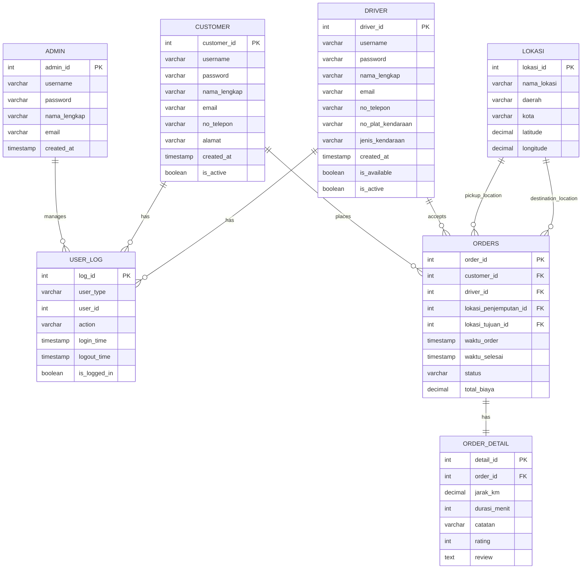

# Entity Relationship Diagram - Aplikasi Ojek Online

```mermaid
erDiagram
    ADMIN ||--o{ USER_LOG : manages
    ADMIN {
        int admin_id PK
        varchar username
        varchar password
        varchar nama_lengkap
        varchar email
        timestamp created_at
    }
    
    CUSTOMER ||--o{ ORDERS : places
    CUSTOMER ||--o{ USER_LOG : has
    CUSTOMER {
        int customer_id PK
        varchar username
        varchar password
        varchar nama_lengkap
        varchar email
        varchar no_telepon
        varchar alamat
        timestamp created_at
        boolean is_active
    }
    
    DRIVER ||--o{ ORDERS : accepts
    DRIVER ||--o{ USER_LOG : has
    DRIVER {
        int driver_id PK
        varchar username
        varchar password
        varchar nama_lengkap
        varchar email
        varchar no_telepon
        varchar no_plat_kendaraan
        varchar jenis_kendaraan
        timestamp created_at
        boolean is_available
        boolean is_active
    }
    
    LOKASI ||--o{ ORDERS : pickup_location
    LOKASI ||--o{ ORDERS : destination_location
    LOKASI {
        int lokasi_id PK
        varchar nama_lokasi
        varchar daerah
        varchar kota
        decimal latitude
        decimal longitude
    }
    
    ORDERS ||--|| ORDER_DETAIL : has
    ORDERS {
        int order_id PK
        int customer_id FK
        int driver_id FK
        int lokasi_penjemputan_id FK
        int lokasi_tujuan_id FK
        timestamp waktu_order
        timestamp waktu_selesai
        varchar status
        decimal total_biaya
    }
    
    ORDER_DETAIL {
        int detail_id PK
        int order_id FK
        decimal jarak_km
        int durasi_menit
        varchar catatan
        int rating
        text review
    }
    
    USER_LOG {
        int log_id PK
        varchar user_type
        int user_id
        varchar action
        timestamp login_time
        timestamp logout_time
        boolean is_logged_in
    }
```
